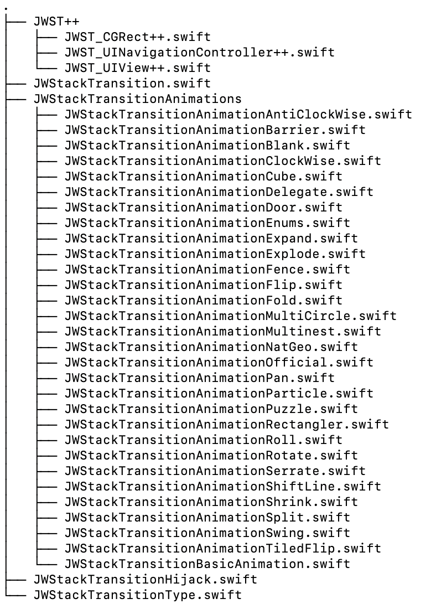

# JWStackTransition

[](https://travis-ci.org/Sfh03031/JWStackTransition)
[](https://cocoapods.org/pods/JWStackTransition)
[](https://cocoapods.org/pods/JWStackTransition)
[](https://cocoapods.org/pods/JWStackTransition)

## Introduction

## All animation types and some examples

The library currently contains the following animations

+ **AntiClockWise**

  + **anticlockwise** - default case which is the same as `anticlockwiseCustomized(1.5)`.
    
  + **anticlockwiseCustomized(startAngle: CGFloat)** - default animation start angle is `1.5`, angle range is `[0.0, 2.0]`.

<table>
    <tr>
        <td></td>
        <td></td>
        <td></td>
        <td></td>
        <td></td>
    </tr>
        <tr>
        <th>start angle is 0.0</th>
        <th>start angle is 0.5</th>
        <th>start angle is 1.0</th>
        <th>start angle is 1.5</th>
        <th>start angle is 2.0</th>
    </tr>
</table>

****

+ **Barrier**

  + **barrier** - default case which is the same as `barrierCustomized(.toTop, width: 20.0)`.
  
  + **barrierCustomized(_ type: JWStackTransitionAnimationBarrierFadeDirectionType, width: CGFloat)** - default animation type is `toTop`, default barrier width is `20.0`.

<table>
    <tr>
        <td></td>
        <td></td>
        <td></td>
        <td></td>
    </tr>
    <tr>
        <th>toTop and width is 20</th>
        <th>toLeft and width is 5</th>
        <th>toRight and width is 10</th>
        <th>toBottom and width is 15</th>
    </tr>
</table>

<table>
    <tr>
        <td></td>
        <td></td>
    </tr>
    <tr>
        <th>toVerticalCenter, 20</th>
        <th>toHorizontalCenter, 25</th>
    </tr>
</table>

****

+ **Circle**

  + **circle**
  
<div align="center" >
  
</div>
  
****

+ **ClockWise**

  + **clockwise** - default case which is the same as `clockwiseCustomized(0.5)`.
    
  + **clockwiseCustomized(startAngle: CGFloat)** - default animation start angle is `0.5`, angle range is `[0.0, 2.0]`.

<table>
    <tr>
        <td></td>
        <td></td>
        <td></td>
        <td></td>
        <td></td>
    </tr>
        <tr>
        <th>start angle is 0.0</th>
        <th>start angle is 0.5</th>
        <th>start angle is 1.0</th>
        <th>start angle is 1.5</th>
        <th>start angle is 2.0</th>
    </tr>
</table>

****

+ **Cube**

  + **cube** - default case which is the same as `cubeCustomized(.fromLeftToRight)`
    
  + **cubeCustomized(_ type: JWStackTransitionAnimationCubeType)** - default animation case is `fromLeftToRight`.

<table>
    <tr>
        <td></td>
        <td></td>
        <td></td>
        <td></td>
    </tr>
        <tr>
        <th>fromLeftToRight</th>
        <th>fromRightToLeft</th>
        <th>fromTopToBottom</th>
        <th>fromBottomToTop</th>
    </tr>
</table>

****

## Tree

Directory structure of SFStyleKit:

<div align="center" >
  
</div>

also, [DeepWiki](https://deepwiki.com/Sfh03031/SFStyleKit/) may help you better understand SFStyleKit

## Requirements

* iOS 12.0 or later
* Swift 5.9.2
* Xcode 15.1

## Installation

JWStackTransition is available through [CocoaPods](https://cocoapods.org). To install
it, simply add the following line to your Podfile:

```ruby

pod 'JWStackTransition', :git => 'https://github.com/Sfh03031/JWStackTransition.git'

```

## Usage

## Change log

## Author

Sfh03031, sfh894645252@163.com

## License

JWStackTransition is available under the MIT license. See the LICENSE file for more info.
