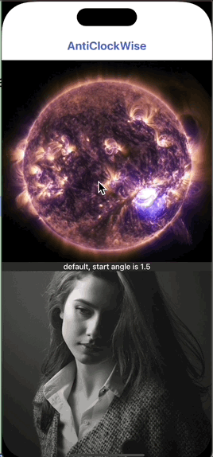

# JWStackTransition

[](https://travis-ci.org/Sfh03031/JWStackTransition)
[](https://cocoapods.org/pods/JWStackTransition)
[](https://cocoapods.org/pods/JWStackTransition)
[](https://cocoapods.org/pods/JWStackTransition)

## Introduction

## Example

The library currently contains the following animations

###AntiClockWise

    **anticlockwise**, default case which is the same as ``anticlockwiseCustomized(1.5)``
    
    **anticlockwiseCustomized(startAngle: CGFloat)**, default animation start angle is ``1.5``, angle range is ``[0.0, 2.0]``

<table width="100%">
    <tr>
        <th>start angle is 0.0</th>
        <th>start angle is 0.5</th>
        <th>start angle is 1.0</th>
        <th>start angle is 1.5</th>
        <th>start angle is 2.0</th>
    </tr>
    <tr>
        <td></td>
        <td></td>
        <td></td>
        <td></td>
        <td></td>
    </tr>
</table>

+ **Barrier**

<table>
<tr>
<th width="20%">default, toTop and width is 20</th>
<th>toLeft and width is 5</th>
<th>toRight and width is 10</th>
<th>toBottom and width is 15</th>
<th>toVerticalCenter and width is 20</th>
<th>toHorizontalCenter and width is 25</th>
</tr>
<tr>
<td width="20%"></td>
<td></td>
<td></td>
<td></td>
<td></td>
<td></td>
</tr>
<tr>
<th width="20%">.barrier</th>
<th>.barrierCustomized(.toLeft, width: 5)</th>
<th>.barrierCustomized(.toRight, width: 10)</th>
<th>.barrierCustomized(.toBottom, width: 15)</th>
<th>.barrierCustomized(.toVerticalCenter, width: 20)</th>
<th>.barrierCustomized(.toHorizontalCenter, width: 25)</th>
</tr>
</table>

## Tree

Directory structure of SFStyleKit:

<div align="center" >
  
</div>

also, [DeepWiki](https://deepwiki.com/Sfh03031/SFStyleKit/) may help you better understand SFStyleKit

## Requirements

* iOS 12.0 or later
* Swift 5.9.2
* Xcode 15.1

## Installation

JWStackTransition is available through [CocoaPods](https://cocoapods.org). To install
it, simply add the following line to your Podfile:

```ruby

pod 'JWStackTransition', :git => 'https://github.com/Sfh03031/JWStackTransition.git'

```

## Usage

## Change log

## Author

Sfh03031, sfh894645252@163.com

## License

JWStackTransition is available under the MIT license. See the LICENSE file for more info.
